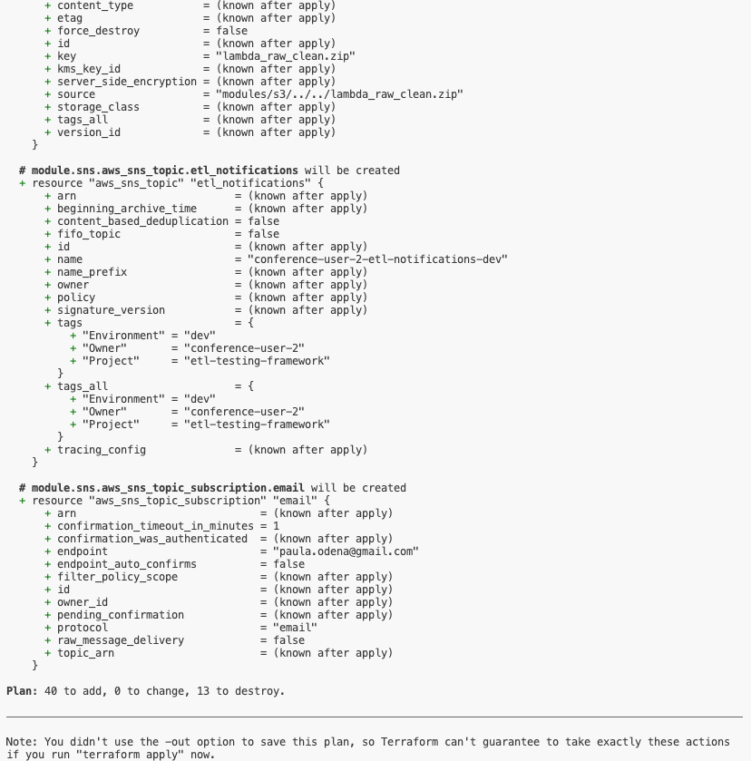

# Exercise 1: Setting Up the Environment

Welcome to the first exercise of our ETL Testing Framework tutorial! In this exercise, you'll set up the necessary AWS infrastructure and local environment to begin working with the ETL testing framework.

## Table of Contents
1. [Overview](#overview)
2. [Prerequisites](#prerequisites)
3. [Step-by-Step Instructions](#step-by-step-instructions)
    - [1. AWS Account Setup](#1-aws-account-setup)
    - [2. Fork the Repository](#2-fork-the-repository)
    - [3. Environment Setup](#3-environment-setup)
    - [4. Terraform Initialization](#4-terraform-initialization)
    - [5. AWS Resource Verification](#5-aws-resource-verification)
4. [Common Issues and Tips](#common-issues-and-tips)
5. [Next Steps](#next-steps)

## Overview
In this exercise, you will:
- Get a temporary AWS account provided by the speaker on the conference. 
- Fork the GitHub repository and launch a Codespace.
- Initialize and deploy the infrastructure using Terraform.
- Verify that all necessary AWS resources have been created.

## Prerequisites
Before you begin, make sure you have the following:
- An AWS account. Temporary accounts will be provided.
- A GitHub account with access to the repository and GitHub Codespaces enabled.
- Basic understanding of Git, Terraform, and AWS services.
- IAM role with administrative privileges or specific permissions for S3, IAM, Lambda, DynamoDB, CodeBuild, and CodePipeline.


## Step-by-Step Instructions

### 1. AWS Account Setup
During this tutorial, each attendee will be provided with temporary AWS credentials (Access Key ID and Secret Access Key) that can be used to set up and deploy the required infrastructure. **These credentials are strictly temporary and will be removed immediately after the tutorial.**

### Using Provided AWS Credentials

- **Access Key ID** and **Secret Access Key** will be shared with you at the start of the tutorial.
- If you prefer to use your own AWS account, you are welcome to do so. In this case please make sure to create an access token key for your user and have it at hand. And also take note of your aws username. **username** will be the `<owner>` on the `<setup_infrastructure.sh>`, [see section 3](#3-environment-setup).
### 2. Fork the Repository
1. Go to the main repository on GitHub.
2. Click the "Fork" button at the top right to fork the repository into your own GitHub space.
    - 
2. **Launch a Codespace**:
    - Once you have forked the repository, **navigate to your fork**.
    - Click on the "Code" button, "Codespaces" tab, then select "Create codespace on master" to create a new Codespace.
    - 
    - The Codespace will automatically set up your environment based on the repository's configuration (e.g., `.devcontainer`).
   **Important, this process can take few minutes, be patient:**
   
    - You will know the CodeSpace is ready when you can see: 
   
2. **Checkout the initial branch**:
   - In order to switch branches you can run git commands in the terminal:
   ```bash
    git checkout master
    ```
   Or you can interact directly with the IDE  
   
### 3. Environment Setup
To set up the necessary AWS infrastructure for the ETL testing framework, use the `setup_infrastructure.sh` script. This script will automate parts of the setup process, including configuring backends, generating necessary Terraform variable files, and packaging Lambda functions.

#### What `setup_infrastructure.sh` Does:
- **Configures Terraform Backends**: Runs the `configure_backend.sh` script to set up Terraform backend configurations based on your user details.
- **Generates Terraform Variable Files**: Executes the `generate_tfvars.sh` script to create `.tfvars` files with the appropriate parameters for your environment.
- **Packages Lambda Functions**: Calls the `package_lambdas.sh` script to package Lambda functions and prepare them for deployment.

#### Running the `setup_infrastructure.sh` Script

1. **Navigate to the `scripts` Directory**:
   - First, ensure you are in the root directory of your repository:
   Replace `<owner>` with your provided aws user account (i.e. conference-user-x).
   ```bash
   cd scripts && ./setup_infrastructure.sh <owner>
   ```
2. **AWS Configuration**:
   -  During the script execution, you may be prompted to configure your AWS credentials. If so, enter your AWS access key, secret access key, default region name, and default output format. This is typically handled using the aws configure command:`aws configure`but you don't need to execute it because it is already executed on the setup-environment.sh
   - When prompted, enter:
     - AWS Access Key ID: Your AWS access key ID.
     - AWS Secret Access Key: Your AWS secret access key.
     - Default Region Name: The AWS region you wish to use (e.g., eu-west-1).
     - Default Output Format: Use json unless otherwise needed.

### 4. Terraform Initialization

In this section, you will initialize and apply Terraform configurations for different purposes:

- **iac/backend**: Infrastructure for the terraform state
- **iac/cicd**: Infrastructure related to CI/CD pipelines.
- **iac/etl**: Infrastructure related to ETL processes.

Before deploying the CI/CD and ETL infrastructures, you need to set up the backend infrastructure where Terraform will store its state remotely in AWS using an S3 bucket and a DynamoDB table.

#### 4.1 Deploy Terraform Backend Infrastructure

1. **Navigate to the Backend Terraform Configuration**:
    - First, navigate to the `backend` folder within`iac` 
    - These folder contain the Terraform configuration files necessary to set up the S3 bucket and DynamoDB table that will store your Terraform state.

    ```bash
    cd ../iac/backend
    ```

2. **Review the Terraform Configuration**:
    - The `main.tf` file creates an S3 bucket to store your Terraform state files and a DynamoDB table to manage state locking and consistency.


3. **Initialize and Apply the Backend Configuration**:
    - Initialize and apply the Terraform configuration to create the S3 bucket and DynamoDB table.

    ```bash
    terraform init
      ```
     ```bash
    terraform apply
      ```
   
    - Confirm the apply action when prompted writting `yes`.

    

#### 4.2 Deploy CI/CD Infrastructure

1. **Navigate to the CI/CD Terraform Directory**:
    - Move to the `iac/cicd` directory where the Terraform files for setting up CI/CD infrastructure are located.

    ```bash
    cd ../cicd
    ```

2. **Initialize Terraform**:
    - Initialize Terraform in this directory to download the necessary providers and prepare the environment.

    ```bash
    terraform init
    ```

3. **Validate Terraform Configuration**:
    - Run the following command to ensure that the Terraform configuration files are syntactically correct.

    ```bash
    terraform validate
    ```

4. **Plan the CI/CD Infrastructure**:
    - Create an execution plan to see what resources Terraform will create or modify.

    ```bash
    terraform plan
    ```

    

5. **Apply the CI/CD Infrastructure**:
    - Apply the Terraform configuration to provision the CI/CD infrastructure. Confirm when prompted.

    ```bash
    terraform apply
    ```
6. **Enable GitHub codestar connection**:
   - This will allow aws to communicate with GitHub.
   - [Login to aws Console](assets/github-codespace-ready.png)
   - [Follow this tutorial](https://087559609246.signin.aws.amazon.com/console?region=eu-west-1)

    

#### 4.3 Deploy ETL Infrastructure

1. **Navigate to the ETL Terraform Directory**:
    - Now, move to the `iac_etl` directory to deploy the ETL infrastructure.

    ```bash
    cd ../etl
    ```

2. **Initialize Terraform**:
    - Initialize Terraform in this directory to download the necessary providers and prepare the environment.

    ```bash
    terraform init
    ```

3. **Validate Terraform Configuration**:
    - Run the following command to ensure that the Terraform configuration files are syntactically correct.

    ```bash
    terraform validate
    ```

4. **Plan the ETL Infrastructure**:
    - Create an execution plan to see what resources Terraform will create or modify.

    ```bash
    terraform plan
    ```

    

5. **Apply the ETL Infrastructure**:
    - Apply the Terraform configuration to provision the ETL infrastructure. Confirm when prompted.

    ```bash
    terraform apply
    ```

    

---


### 5. AWS Resource Verification
1. **Login to AWS Console**: Log in to your AWS account and verify that all resources have been created.
2. **Check S3 Buckets**: Confirm that the S3 buckets for the backend, Lambda functions, raw, clean, and curated data are present.
    - 
3. **Check Other Resources**: Verify that the IAM roles, CodeBuild, and CodePipeline have been created.
    - 

## Common Issues and Tips
- **Terraform Init Errors**: Ensure your AWS credentials are correctly configured. Use `aws configure` to reset them if necessary.
- **Python Environment Issues**: If you encounter issues with Python dependencies, ensure you are using the correct Python version and the virtual environment is activated.
- **Resource Verification**: Double-check the AWS region specified in your Terraform configuration; resources may be created in a different region if it's not consistent.

## Next Steps
Once you have successfully set up your environment and verified the resources, you are ready to move on to [Exercise 2: Running the Data Generator and ETL Processes](#).
