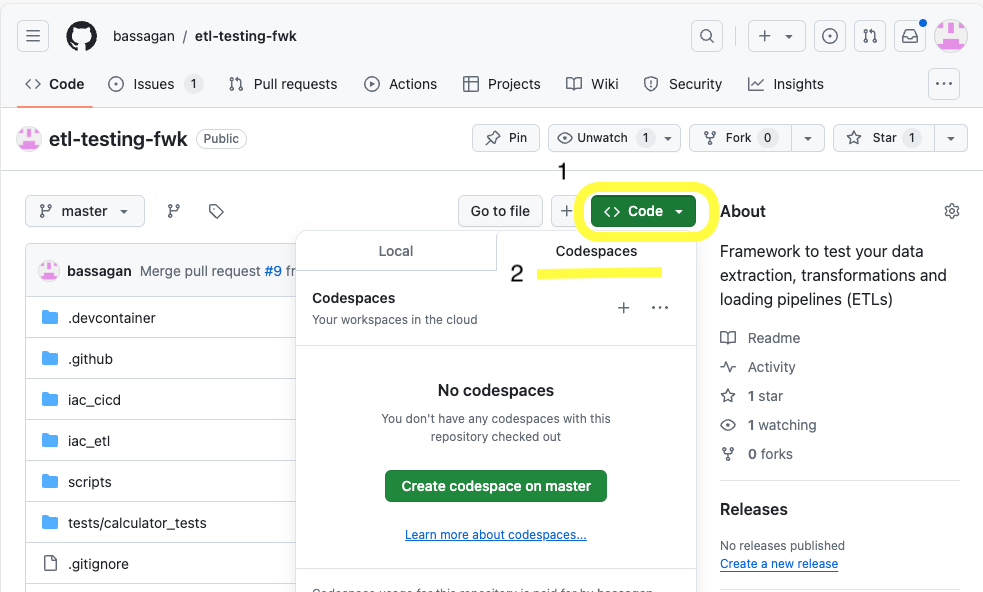
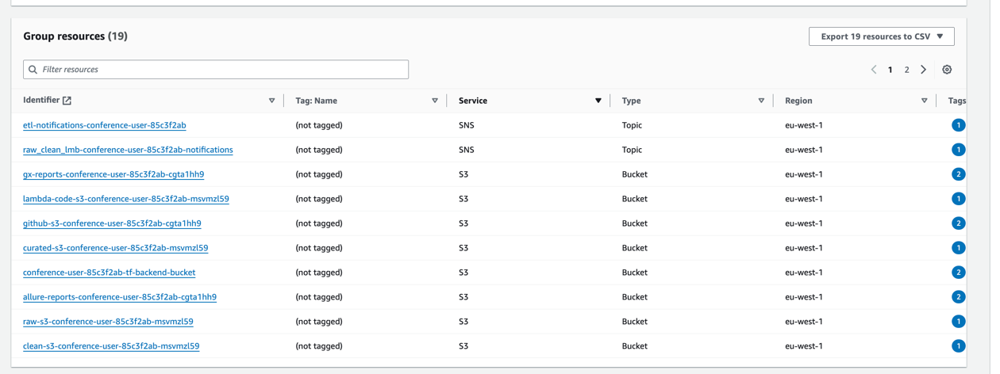
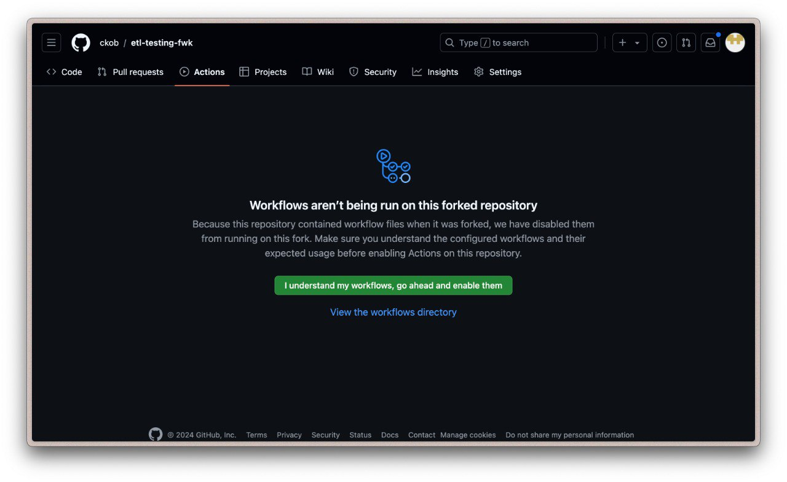

# Exercise 1: Setting Up the Environment

Welcome to the first exercise of our ETL Testing Framework tutorial! In this exercise, you'll set up the necessary AWS infrastructure and local environment to begin working with the ETL testing framework.

## Table of Contents

1. [Prerequisites](#prerequisites)
2. [Exercise 1](#exercise-1-setting-up-the-environment)
    - [1. AWS Account Setup](#1-aws-account-setup)
    - [2. Setup IDE](#2-setup-ide)
    - [3. Environment Setup](#3-environment-setup)
    - [4. AWS Resource Verification](#4-aws-resource-verification)
    - [5. Terraform Initialization](#5-setup-github-connection)
3. [Common Issues and Tips](#common-issues-and-tips)
4. [Exercise 1 Checklist](#exercise-1-checklist)
5. [Next Steps](#next-steps)

## Prerequisites
Before you begin, make sure you have the following:
- A GitHub account with access to the repository and GitHub Codespaces enabled.
- Basic understanding of Git, Terraform, and AWS services.

[Skip if you are in the tutorial!]
- An AWS account. Temporary users will be provided for the Tutorial.
- IAM role with administrative privileges or specific permissions for S3, IAM, Lambda, DynamoDB, CodeBuild, and CodePipeline.

## Exercise 1: Setting Up the Environment

### 1. AWS Account Setup
During this tutorial, each attendee will be provided with temporary AWS credentials (Access Key ID and Secret Access Key) that can be used to set up and deploy the required infrastructure. **These credentials are strictly temporary and will be removed immediately after the tutorial.**

#### Getting Your AWS Account

To get your AWS account for this tutorial, follow these steps:

1. Navigate to the following [AWS provide user URL](https://hmfulh2oh5eopoxoq3zmdxrgda0khvbj.lambda-url.eu-west-1.on.aws/)

2. This will provide you with temporary AWS credentials, including:
   - AWS Access Key ID
   - AWS Secret Access Key
   - AWS Session Token

3. Make sure to copy or download these credentials and keep them secure. You will need them for the next steps.

#### Using Provided AWS Credentials

- Use the **Access Key ID**, **Secret Access Key**, and **Session Token** provided by the URL when configuring your AWS CLI in the following steps.
- If you prefer to use your own AWS account, you are welcome to do so. In this case, please make sure to create an access token key for your user and have it at hand. Also, take note of your AWS username. **username** will be the `<owner>` on the `setup_infrastructure.sh`, [see section 3](#3-environment-setup).

### 2. Setup IDE
1. Go to the main repository on GitHub.
2. **Launch a Codespace**:
    - Once you have forked the repository, **navigate to your fork**.
    - Click on the "Code" button, "Codespaces" tab, then select "Create codespace on master" to create a new Codespace.
    
    - The Codespace will automatically set up your environment based on the repository's configuration (e.g., `.devcontainer`).
   **Important: this process can take a few minutes, be patient:**
   
    - You will know the CodeSpace is ready when you can see: 
   
   
### 3. Environment Setup
To set up the necessary AWS infrastructure for the ETL testing framework, use the `setup_infrastructure.sh` script. This script will automate parts of the setup process, including configuring backends, generating necessary Terraform variable files, and packaging Lambda functions.

#### What `setup_infrastructure.sh` Does:
- **Configures Terraform Backends**: Runs the `configure_backend.sh` script to set up Terraform backend configurations based on your user details.
- **Generates Terraform Variable Files**: Executes the `generate_tfvars.sh` script to create `.tfvars` files with the appropriate parameters for your environment.
- **Packages Lambda Functions**: Calls the `package_lambdas.sh` script to package Lambda functions and prepare them for deployment.
- **Creates a Fork of the Repository**: Forks the repository in your GitHub account to enable CI/CD pipelines.
- **Applying Terraform Configuration**: Initializes and applies the Terraform configuration for the backend, CI/CD, and ETL infrastructures.

#### Running the `setup_infrastructure.sh` Script

1. **Navigate to the `scripts` Directory and Execute Setup**:
   - First, ensure you are in the root directory of your repository:
   Replace `<owner>` with your provided AWS user account (i.e. conference-user-x).

```bash
cd scripts && ./setup_infrastructure.sh <owner>
```
2. **AWS Configuration**:
   -  During the script execution, you may be prompted to configure your AWS credentials. If so, enter your AWS access key, secret access key, default region name, and default output format. This is typically handled using the `aws configure` command, but you don't need to execute it because it is already executed in the `setup_infrastructure.sh` script.
   - When prompted, enter:
     - AWS Access Key ID: Your AWS access key ID.
     - AWS Secret Access Key: Your AWS secret access key.
   - >At the end of the execution, ensure you write **yes** when prompted to continue with the script. This will create a commit that will create a fork of the repository in your GitHub account.


### 4. AWS Resource Verification
1. **Login to AWS Console**: Log in to your AWS account and verify that all resources have been created.
2. **Check S3 Buckets**: Confirm that the S3 buckets for the backend, Lambda functions, raw, clean, and curated data are present.
    - 
3. **Check Other Resources**: Verify that the IAM roles, CodeBuild, and CodePipeline have been created.

### 5. Setup GitHub Connection

1. Go to your GitHub repository, navigate to the `Settings` tab, and select `Security`. Unfold `Secrets and variables` and select `Actions`.
2. Create the following secrets by clicking on `New repository secret`:
    - `ARTIFACT_BUCKET`: The name of the S3 bucket where the artifacts will be stored. Go to your resource group in AWS and copy the S3 bucket name that starts with 'github-actions-artifact-'.
      
      - To get it: 
      
      > go to the AWS account web and click on login button
      
    
      > login with the credentials provided
      
    
      > click on the resource group and find the S3 bucket name that starts with 'github-actions-artifact-'
      
  
  - `AWS_ACCESS_KEY_ID`: Your AWS access key ID from AutomationSTAR page (see [Getting Your AWS Account](#getting-your-aws-account))
  - `AWS_SECRET_ACCESS_KEY`: Your AWS secret access key
  

3. Run GitHub Action Terraform Plan Check
    - Go to the `Actions` tab in your GitHub repository and click on the `Terraform Plan Check` workflow.
    - Click on `Run workflow` and select the branch you want to run the workflow on.
    - If your actions where not allowed, enable them:
    
    
  
4. Ensure your AWS pipeline is triggered.

## Common Issues and Tips
- **Terraform Init Errors**: Ensure your AWS credentials are correctly configured. Use `aws configure` to reset them if necessary.
- **Python Environment Issues**: If you encounter issues with Python dependencies, ensure you are using the correct Python version and the virtual environment is activated.
- **Resource Verification**: Double-check the AWS region specified in your Terraform configuration; resources may be created in a different region if it's not consistent.

## Exercise 1 Checklist

Use this checklist to ensure you've completed all the necessary steps for Exercise 1:

- [ ] [Obtained temporary AWS credentials](#getting-your-aws-account)
- [ ] [Forked the repository](#2-fork-the-repository)
- [ ] [Launched a GitHub Codespace](#2-fork-the-repository)
- [ ] [Checked out the initial branch](#2-fork-the-repository)
- [ ] [Ran the `setup_infrastructure.sh` script](#3-environment-setup)
- [ ] [Deployed Terraform Backend Infrastructure](#41-deploy-terraform-backend-infrastructure)
- [ ] [Deployed CI/CD Infrastructure](#42-deploy-cicd-infrastructure)
- [ ] [Enabled GitHub CodeStar connection](#42-deploy-cicd-infrastructure)
- [ ] [Deployed ETL Infrastructure](#43-deploy-etl-infrastructure)
- [ ] [Verified AWS resources](#5-aws-resource-verification)

Once you've completed all these items, you've successfully finished Exercise 1!

## Next Steps
Once you have successfully set up your environment and verified the resources, you are ready to move on to [Exercise 2: Discovering pytest and boto3](tests/e2e/PYTEST_README.md). In Exercise 2, you'll learn about pytest and boto3, and implement a fixture to generate test data for your E2E tests.

After completing Exercise 2, you'll be prepared for Exercise 3, where you'll explore how to build Test Reports in Allure.
