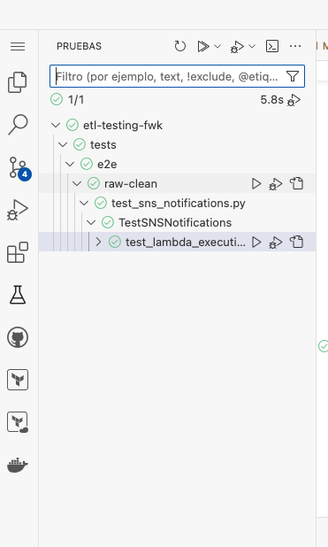

# Exercise 2: Discovering pytest and boto3

Welcome to the second exercise of our ETL Testing Framework tutorial! In this exercise, you'll learn about pytest and boto3, and implement a fixture to generate test data for your E2E tests.

## Table of Contents
1. [Overview](#overview)
2. [Prerequisites](#prerequisites)
3. [Setting up the testing environment](#setting-up-the-testing-environment)
4. [Exercise 2: Implementing a Test Data Generator Fixture](#exercise-2-implementing-a-test-data-generator-fixture)
5. [Common Issues and Tips](#common-issues-and-tips)
6. [Next Steps](#next-steps)

## Exercise 2 Checklist

Use this checklist to ensure you've completed all the necessary steps for Exercise 2:

- [ ] Set up the testing environment
- [ ] Understand the existing test structure
- [ ] Move existing fixtures to conftest.py
- [ ] Implement the generate_test_data fixture
- [ ] Update test_sns_notifications.py to use the new fixture
- [ ] Run and verify the updated tests

Once you've checked off all these items, you've successfully completed Exercise 2!

## Prerequisites
Before you begin, make sure you have completed Exercise 1 and have the following:
- AWS credentials configured
- Access to the repository and necessary AWS resources
- Basic understanding of Python, pytest, and boto3

## Setting up the testing environment

1. Set up the testing environment by running the provided script:

```bash
   cd scripts  
   ```
    
```bash
   eval $(./setup_environment_tests.sh) 
   ```

2. Navigate to the `tests` directory:
```bash
   cd ../tests/
   ```

2. Install requirements:
```bash
   pip install -r requirements.txt
```


## Exercise 2.1: Executing and debugging test cases

In this part of the exercise, you'll learn how to run and debug your test cases using pytest. Follow these steps to execute and debug your tests:

1. To run all tests with verbose output, use the following command:

```
pytest -v
```

2. To run a specific test file, use:
```
pytest e2e/raw-clean/test_sns_notifications.py
```

3. For debugging, you can use the Test Explorer in the lateral menu of your CodeSpace. It's represented by a flask icon.



Expand the test tree to see all available tests. You should see a structure similar to:
   - etl-testing-fwk
     - tests
       - e2e
         - raw-clean
           - test_sns_notifications.py
             - TestSNSNotifications
               - test_lambda_execution


## Exercise 2.2: Implementing a Test Data Generator Fixture

In this exercise, you'll implement a fixture to generate test data for your E2E tests using pytest and boto3. This test data is crucial for verifying that data is correctly moved and processed in the clean layer of our ETL pipeline.

The need for generating test data arises from the requirement to have consistent, controlled data sets for our tests. By generating this data programmatically, we can ensure that our tests are repeatable and that they cover various scenarios that might occur in the real data processing pipeline.

Detailed instructions and code comments for this exercise are provided in the [`conftest.py`](e2e/raw-clean/conftest.py) file. You'll be working primarily with this file to implement the new fixture.

### Steps:

1. Open the [`conftest.py`](e2e/raw-clean/conftest.py) file in the `tests/e2e/raw-clean/` directory.
2. Move all existing fixtures from [`test_sns_notifications.py`](e2e/raw-clean/test_sns_notifications.py) to [`conftest.py`](e2e/raw-clean/conftest.py).
3. Create a new fixture named `generate_test_data` in `conftest.py`.
4. Use the `@pytest.fixture(autouse=True)` decorator for the new fixture.
5. Implement the fixture to call the data generator lambda function using boto3.
6. Assert that the data generator lambda function was called successfully.
7. Update `test_sns_notifications.py` to remove moved fixtures and use the new `generate_test_data` fixture.

## Common Issues and Tips
- Ensure your AWS credentials are correctly configured and have the necessary permissions.
- Double-check that all required environment variables are set correctly.
- If tests fail, review the error messages and use debugging techniques to identify the issue.

## Next Steps
Once you have successfully implemented and verified the test data generator fixture, you are ready to move on to Exercise 3, where you'll explore Great Expectations for testing data transformations.

## Reference Solution

For reference and guidance, you can check the `feature/exercise_2_solved` branch. This branch contains a complete solution for Exercise 2, which may be helpful if you encounter any difficulties or want to compare your implementation.

To check out the reference solution, use the following command:
```bash
git checkout feature/exercise_2_solved
```

Remember, it's best to try solving the exercise on your own first, but don't hesitate to use the reference solution if you need additional clarity or want to verify your approach.

## Key Takeaways

In this exercise, you've learned and practiced the following key concepts:

1. Setting up a pytest testing environment for AWS-based ETL processes.
2. Using pytest fixtures to manage test setup and teardown.
3. Implementing a test data generator fixture using boto3 to interact with AWS Lambda.
4. Moving common fixtures to conftest.py for better organization and reusability.
5. Executing and debugging test cases using pytest and the VS Code Test Explorer.
6. Writing end-to-end tests for SNS notifications in an ETL pipeline.
7. Using environment variables to configure tests for different environments.

These skills form a solid foundation for writing robust, maintainable tests for complex ETL processes in AWS environments.